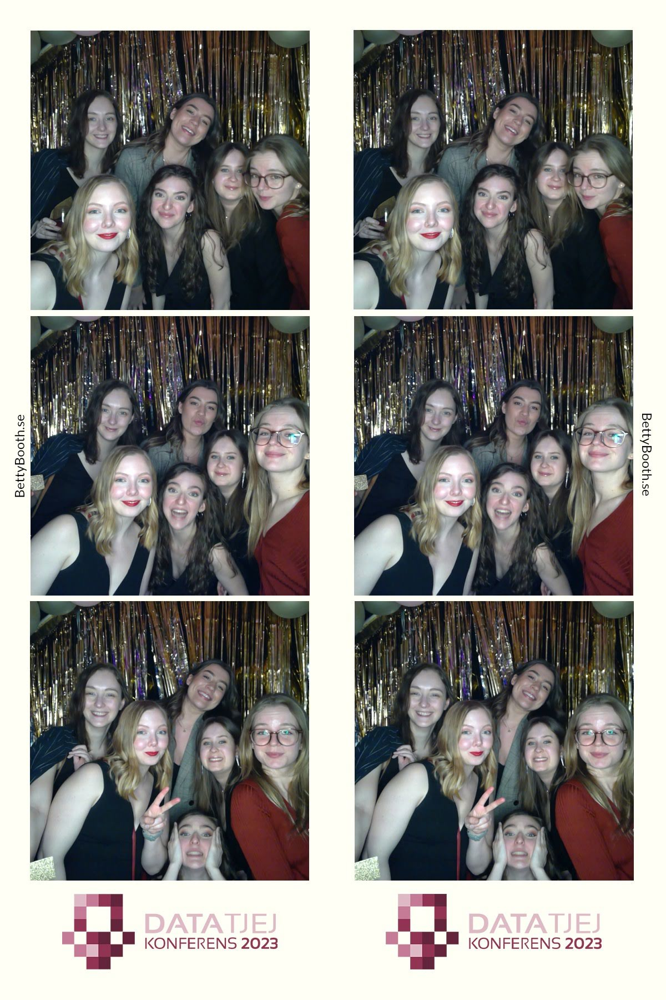
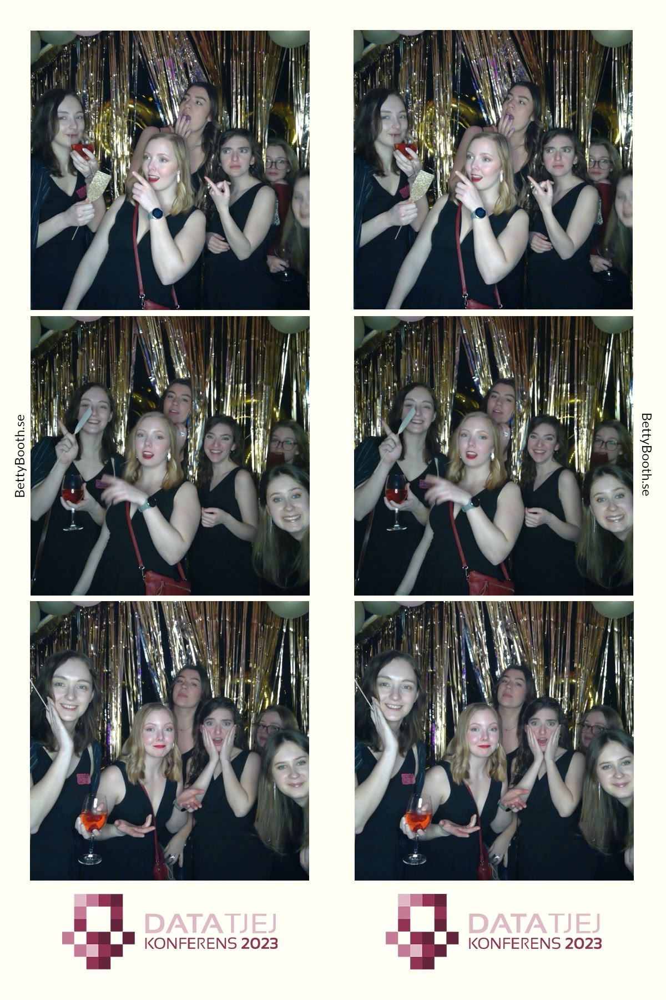
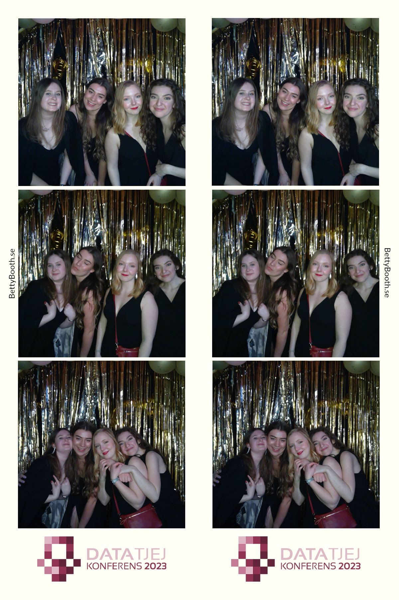

<!DOCTYPE html>
<html lang="sv">
<head>
	<meta charset="UTF-8">
	<title>
    </title>
    
</head>
<body>
        

            

              
              
            

            

                <h1>Femme++</h1>
                

                   Femme++ is a committee that primarily focuses on women, non-binary, and transgender individuals. 
                

                

                    We believe that it is important to have a space where those who often find themselves in the minority within computer science can talk about things they otherwise find difficult to discuss, or to just connect with like-minded individuals and have fun.
                

                

                    We spend time together, go out for a coffee, eat dinners and have parties. 
                

            

            

              
              

        

</body>
</html>