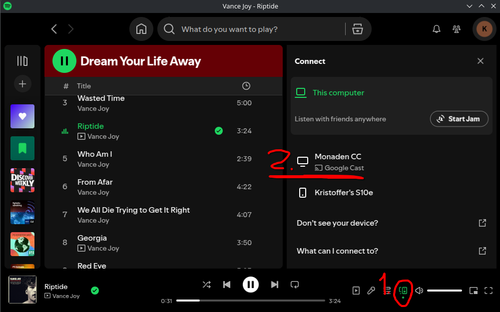

## IKEA TRADFRI color bulbs
The bulbs are controlled over zigbee, they can change intensity, color, and warmth. 
### Pairing
They can be putt into pairing mode by switching them on and on 6 times, https://www.youtube.com/watch?v=npxOrPxVfe0. 

## Chromecast
The Chromecast is hocked to the sound and video system in the Monad. By connecting your computer or phone to the monaden wifi, you will be able to control the Chromecast. For example, this is how to play songs from Spotify on the Chromecast:

## RADFRI remote controller
This remote similarly can be heard over zigbee. It has 5 buttons to press, 4 of which can be held. Each action is distinct. 
### Paring
The remote can be put in pairing mode by holding it close to the coordinator and pressing the inside button, next to the CR2032 battery, 4 times in 5s.
### Usage
The remote has two modes Chromecast and Lights:

## Application
The application can mainly be used to control the light, and full media control is planned in the future. You can open the web-app if you are connect to the monaden wifi at [http://megaserver/](http://megaserver/).

