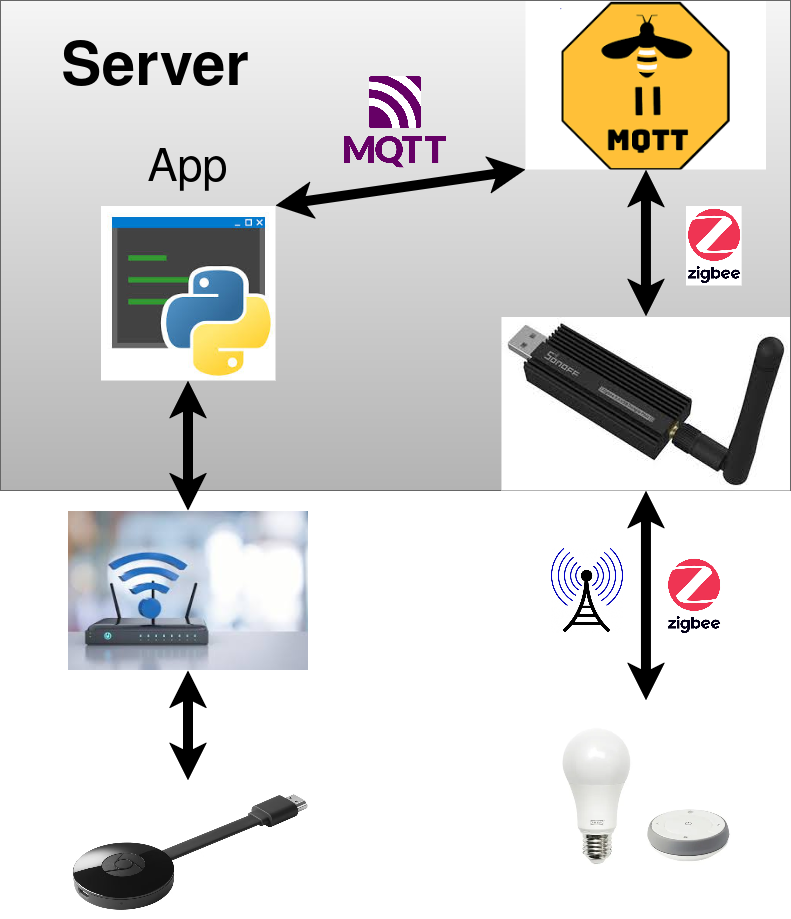

# The server
The server manages and runs the [application](https://github.com/Datavetenskapsdivisionen/monaden-iot) as well as zigbee2mqtt. The app and zigbee2mqtt communicate through mqtt, zigbee2mqtt, the dongle, and the devices communicate through zigbee. Finally, the app communicates with the Chromecast over wifi. 


## App service
 The python application is ran through a service such that it restarts when crashed and such. The service file can be found at /etc/systemd/system/iot.service. Here you can change the flags with with the app runs. Furthermore, if you want to restart the app you should run  ```sudo systemctl restart iot```, and ```sudo journalctl -u iot``` to view application logs.

## Admin access
To work on this project you need access to the server running the application. Do so by speaking to the person in charge, or [the board](styrelsen@dvet.se). They will grant you ssh access the site user. At the site user's home dir you will find the monaden-iot dir which contains application files, including zigbee2mqtt stuff.

## zigbee2mqtt
To /monaden-iot/zigbee2mtqq/docker-compose.yml you will find the docker-compose file which is used to spin up and down the container in which zigbee2mqtt runs. 
To start ```docker compose -f /path/to/your/project/docker-compose.yml up```:
```docker compose -f /path/to/your/project/docker-compose.yml up -d```
To stop it:
```docker compose -f /path/to/your/project/docker-compose.yml down```
zigbee2mqtt can be interacted with though the terminal or its web-app. The web-app is hosted on  http://localhost:2512 on the server with no port forward. Therefore it can not be directly accessed. 
However, by running ```ssh -nNT -L 2512:localhost:2512 site@megaserver``` on your local computer you can create a tunnel through ssh to your own computer. After witch, you can access the interface at your http://localhost:2512. 

### Pairing devices
To connect devices over the interface first click the "Permit join (all)" button. Then head to the touch link tab, put the devices in pairing mode, the press scan. ](PairDevices.png)


 